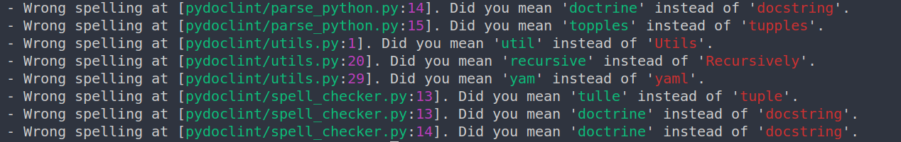

# pydoclint

Verify python docstrings

This project verifies sphinx python docstrings. The intended functionalities will include spell checking, grammar checking, docstring formatting etc.

        usage: pydoclint [-h] path

        Python docstring verifier

        positional arguments:
        path        Directory or file name. If Directory is provided pydoclint will
                    recursively go throw all python files.

        optional arguments:
        -h, --help  show this help message and exit

# Installation
This project has not been published to PyPi yet. You could simple clone this repo and install it using pip.

        cd pydoclint/
        pip install .

# Supported Features
Currently only spell check is supported. However, the intention is add the following formatting verification for docstring. The ambition is to add grammar check check. However, I am not sure if it is going to happen anytime soon :(.

# Usage
After installation use the following command.

        ./doclint <path to file or directory>

If a directory is provided, doclint will find all python file in that directory and start verification and log the result on console.

# Todo
- Problems in running the command needs to be fixed
- Support configuration overriding defined as pylint (.pylintrc)

# Notes
- The project is in early development phase. Some features may not work as intended.
- Contact me if you want to be involved in the development.